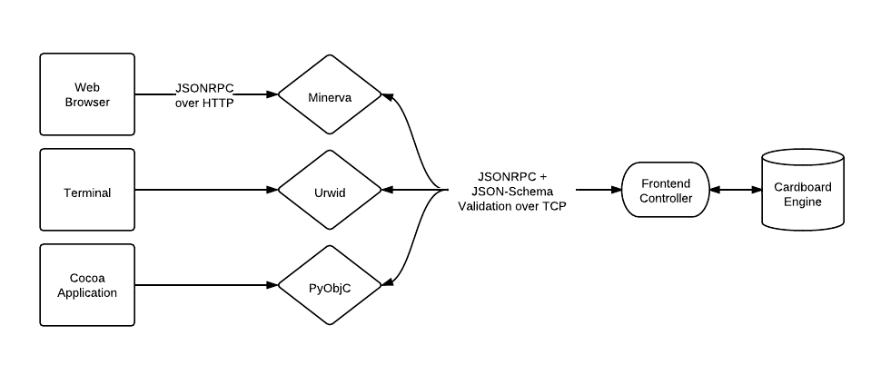

===========================================
Designing and Communicating With a Frontend
===========================================

The Cardboard game engine, by design, does not generally care how a player is
playing a game. What matters is simply that a frontend properly implements the
protocol that Cardboard uses to communicate back and forth with the player.

Frontend Implementations
------------------------

The Frontend Controller
-----------------------

The :py:class:`FrontendController` is an object that knows how to send
communication back and forth between an attached frontend and the game engine.

It does so by converting method calls from the game engine into JSONRPC
requests that are sent to the frontend. For example, if the game engine needs
the active player to select some cards from the battlefield, and calls

    ``game.frontend.select.cards(game.battlefield, how_many=4)``

the :py:class:`FrontendController` will send out a
`JSONRPC (v2.0) <http://www.jsonrpc.org/spec.html>`_ request to whatever
frontend is attached to it, which will look like

    ``{"jsonrpc" : "2.0", "id" : 1, "method" : "select.cards",
    "params" : {"how many" : 4}}``

and expect back a JSONRPC response from the frontend like

    ``{"jsonrpc" : "2.0", "id" : 1, "result" : [18, 11, 21, 4]}``

where each of the members of the ``result`` array are card ids (discussed
below) that the :py:class:`FrontendController` will convert back to
:py:class:`Card` objects and hand back to the game engine.

.. automodule:: cardboard.frontend
